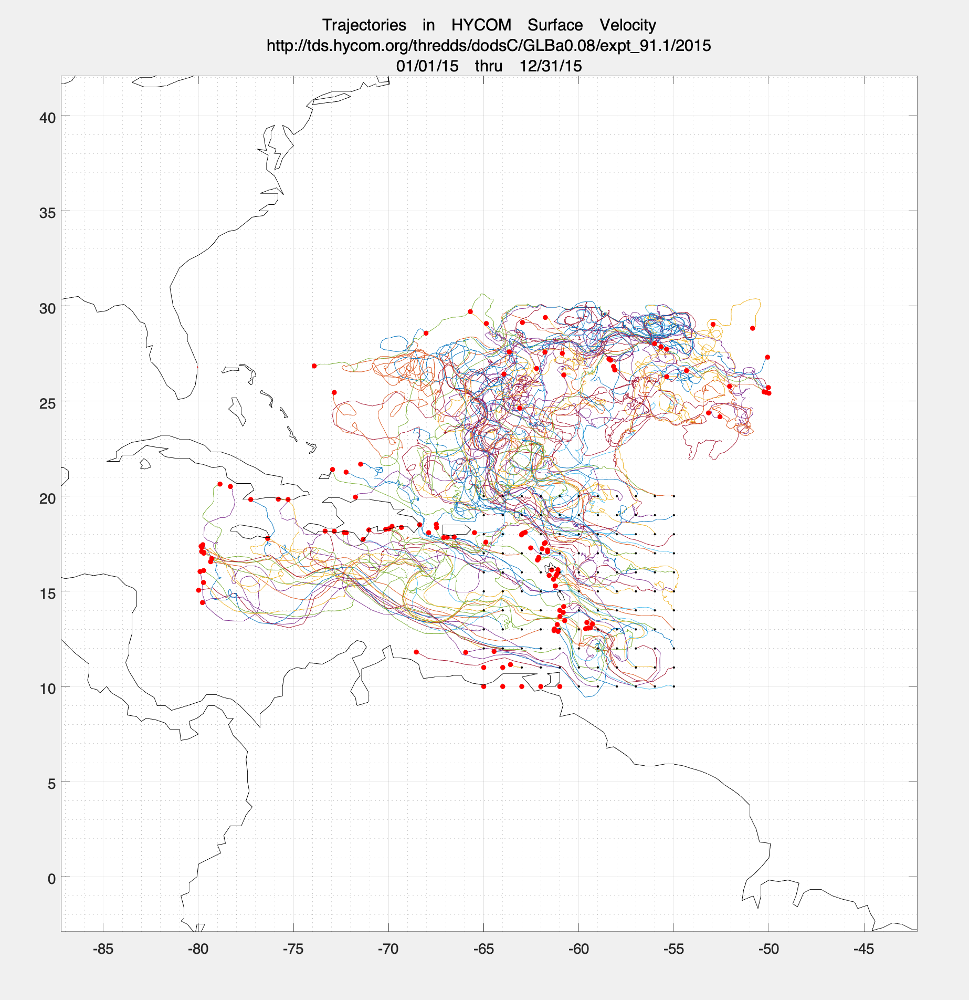

# HycomTracker
Demonstration MATLAB code for particle tracking with HYCOM model output.  This code uses nctoolbox to access and extract variables from HYCOM output posted in THREDDS Data Servers (TDS), like http://tds.hycom.org/thredds/dodsC/GLBa0.08/expt_91.1/2015.  You can get nctoolbox from https://github.com/nctoolbox/nctoolbox

There are 3 main codes: 

+ HycomTrackerPrep - Builds velocity arrays and fake HYCOM grid.  Default subregion is Caribbean and Gulf of Mexico, surface velocities. The default HYCOM URL is http://tds.hycom.org/thredds/dodsC/GLBa0.08/expt_91.1/2015

+ HycomTrackerIC - Generates initial particle locations.  Default is a square patch off the TX/MEX border.  User can edit/enhance as needed.

+ HycomTracker - This converts lon/lat coords to cartesian, calls drog2ddt, and inverts the projected particle locations back to lon/lat.

## Run in MATLAB.
% First step: generate the velocity arrays from HYCOM and fake HYCOM/finite element grid.  
% http://tds.hycom.org/thredds/dodsC/GLBa0.08/expt_91.1/2015

<pre>
[V,G]=HycomTrackerPrep;
</pre>

% Then, build initial condition/locations:
<pre>
IC=HycomTrackerIC;
</pre>

% Pass to drog2ddt, through HycomTracker handler:
<pre>
R=HycomTracker(V,G,IC);
</pre>

% Then, make plots of R.lon and R.lat, etc...
% Subtract 360 from longitude to get it in the range -180->180; note the transpose

% plot the trajectories
<pre>
plot(R.lon'-360,R.lat')
</pre>

% plot the initial positions
<pre>
line(R.lon(:,1)-360,R.lat(:,1),'Marker','.','Color','k','LineStyle','none')
</pre>

